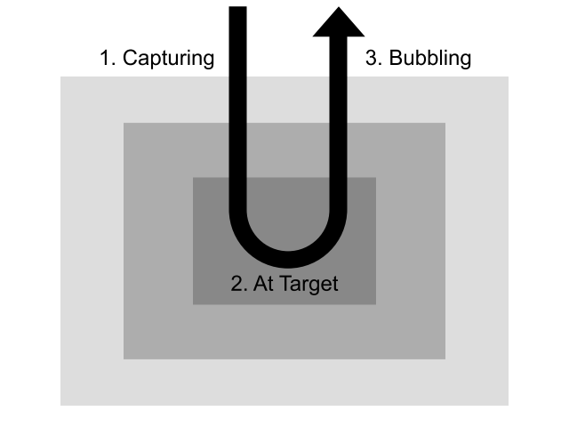

# FDS 브라우저 측 JavaScript

---

## API

Application Programming Interface.

즉 어플리케이션을 프로그래밍할 수 있는 **접점**

---

## DOM API

- Document Object Model, 문서 객체 모델
- [DOM](https://developer.mozilla.org/en-US/docs/Web/API/Document_Object_Model)
- [DOM 소개](https://developer.mozilla.org/ko/docs/Gecko_DOM_Reference/%EC%86%8C%EA%B0%9C)
- [트리](https://javascript-fds.netlify.com/pages/282-data-structures#트리-tree)
- [Event Reference](https://developer.mozilla.org/en-US/docs/Web/Events)
- [Web APIs](https://developer.mozilla.org/en-US/docs/Web/API)

---

## 요소 선택하기

- `document.querySelector(selector)` - CSS 선택자를 통해 **단일 요소** 가져오기
- `document.querySelectorAll(selector)` - CSS 선택자를 통해 **여러 요소** 가져오기
- `el.querySelector(selector)` - CSS 선택자를 통해 **단일 자식 요소** 가져오기
- `el.closest(selector)` - 엘리먼트의 조상 중에 CSS 선택자와 일치하는 **가장 가까운 조상 요소** 가져오기
- `el.matches(selector)` - 해당 요소가 CSS 선택자와 일치하는지 검사하기

<!-- NodeList -->

---

## 요소 내용 조작하기

- `el.textContent` - 요소 본문을 가져오거나 변경할 때 사용하는 속성 (텍스트)
- `el.innerHTML` - 요소 본문을 가져오거나 변경할 때 사용하는 속성 (HTML)

<!-- innerHTML과 XSS -->

---

## 요소 어트리뷰트 조작하기

- `el.hasAttribute(attrName)` - 어트리뷰트가 있는지 검사하기
- `el.getAttribute(attrName)` - 어트리뷰트의 값 가져오기
- `el.setAttribute(attrName, attrValue)` - 어트리뷰트 설정하기
- `el.removeAttribute(attrName)` - 어트리뷰트 삭제하기

---

## 요소 클래스 조작하기

- `el.classList.add(className, ...)` - 클래스 추가
- `el.classList.remove(className, ...)` - 클래스 삭제
- `el.classList.contains(className)` - 클래스 포함 여부 검사

---

## 인라인 스타일 조작하기

- `el.style` - 요소의 인라인 스타일을 읽고 쓸 때 사용하는 객체. `camelCase` 사용
  - `el.style.backgroundColor = '#000000'` - 요소의 배경색을 검은색으로 변경

---

## 이벤트 리스너

- `el.addEventListener(callback)` - 이벤트 리스너 등록
- `el.removeEventListener(callback)` - 이벤트 리스너 제거

---

## DOM 엘리먼트 생성하기

- `document.createElement(tagName)` - 새로운 엘리먼트 객체 생성하기
- `el.cloneNode()` - 엘리먼트 복사하기

---

## DOM 트리 조작하기

- `el.appendChild(newChild)` - 요소 끝에 자식 요소를 삽입하기
- `el.insertBefore(newChild, beforeWhat)` - 원하는 위치에 자식 요소를 삽입하기
- `el.replaceChild(newChild, oldChild)` - 자식 요소를 교체하기
- `el.removeChild(child)` - 자식 요소 제거하기

<!-- appendChild, insertBefore를 통한 위치의 이동 -->

---

## dataset

- `el.dataset` - `data-*` 어트리뷰트를 가져오기. (`kebab-case`가 `camelCase`로 변환됨)

---

## 노드 간 관계

- `el.childNodes` - 자식 노드
- `el.firstElementChild` - 첫 번째 자식 요소
- `el.lastElementChild` - 마지막 자식 요소
- `el.previousElementSibling` - 이전 형제 요소
- `el.nextElementSibling` - 다음 형제 요소
- `el.parentElement` - 부모 요소
- `el.offsetParent` - 포지셔닝의 기준이 되는 조상 요소

---

## 요소의 크기 및 위치

- `el.getBoundingClientRect()` - 화면 좌측 상단으로부터의 요소의 위치 및 요소의 크기를 반환
- `el.offsetHeight` / `el.offsetWidth` - border를 포함한 요소의 크기
- `el.clientHeight` / `el.clientWidth` - border를 제외한 요소의 크기
- `el.scrollHeight` / `el.scrollWidth` - 요소 내부에 포함된 콘텐츠의 크기 (스크롤 가능한 영역의 크기)
- `el.offsetTop` / `el.offsetLeft` - offsetParent로부터의 요소의 위치
- `el.scrollTop` / `el.scrollLeft` - 요소 내부의 콘텐츠가 스크롤된 정도
- `el.clientTop` / `el.clientLeft` - border의 너비

---

## 이벤트 전파

- 버블링이 일어나는 이벤트도 있고, 일어나지 않는 이벤트도 있음 (submit, focus, blur, change 등)

<!--
참고 링크
- https://stackoverflow.com/questions/5574207/html-dom-which-events-do-not-bubble
- https://www.quirksmode.org/js/events_order.html
-->

---

## 이벤트 객체

- `e.target` - 실제로 이벤트를 일으킨 요소
- `e.currentTarget` - 이벤트 전파 과정 중 현재 이벤트가 위치한 요소
- `e.stopPropagation()` - 이벤트 전파 과정을 멈추기
- `e.preventDefault()` - 이벤트가 일으키는 브라우저의 기본 동작과정을 취소하기

---

## 폼 이벤트

- `change` - checkbox, radio등의 타입을 갖는 input 요소나 select 요소에 선택이 일어났을 때 발생
- `input` - text 타입을 갖는 input 요소나 textarea 요소의 값이 변경되었을 때 발생
- `focus` - 키보드 포커스가 해당 요소에 옮겨졌을 때 발생
- `blur` - 키보드 포커스가 해당 요소에서 벗어났을 때 발생
- `submit` - 폼 전송이 일어났을 때 발생

<!-- https://httpbin.org/ -->

---

## 마우스 이벤트

- `click` / `dblclick`
- `mouseover` / `mouseout`
- `mousedown` / `mouseup`
- `mousemove`

---

## 키보드 이벤트

- `keydown`
- `keyup`
- `keypress`

---

## 스크롤 이벤트

- `scroll`
